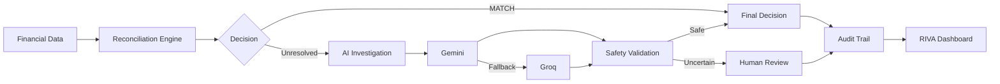

# RIVA — AI Finance Controller

### Reconciliation & Investigation Virtual Agent

**An AI-powered financial reconciliation and investigation system combining deterministic controls, evidence-grounded AI reasoning, provider fallback, safety validation, and human review.**

RIVA reconciles financial transactions across **company ledger, settlements, bank statements, and invoices**. Deterministic rules handle financial calculations first; AI investigates unresolved cases and uncertain cases can be escalated instead of guessed.

- **Reconcile financial evidence** — compare ledger, settlement, bank, and invoice records.
- **Investigate unresolved cases** — Gemini primary with Groq fallback.
- **Stay evidence-grounded** — expose the evidence and prompt used for investigations.
- **Review every decision** — track provider, confidence, safety override, reason, and final decision.
- **Operate from one dashboard** — Overview, Transaction Inspector, Settlement Q&A, Audit Trail, and Human Review.


---

## ✦ Architecture



**Core idea:** deterministic reconciliation comes first. AI is used only for investigation, with provider fallback, safety validation, and human escalation around it.

### Data sources
`company_ledger.csv` · `settlements.csv` · `bank_statement.csv` · `invoices.csv`

### Decision flow
**Financial records → Reconciliation → AI investigation when needed → Safety validation → Final decision → Audit trail**

---

## ✦ Dashboard

RIVA provides five focused views:

| View | Purpose |
| --- | --- |
| **Overview** | Dataset metrics, reconciliation health, and benchmark status |
| **Transaction Inspector** | Full ledger, settlement, bank, invoice, reconciliation, and AI evidence |
| **Settlement Q&A** | Evidence-grounded questions about a transaction |
| **Audit Trail** | AI provider, decision, confidence, safety status, and reason |
| **Human Review** | Read-only queue for cases requiring manual review |

---

## ✦ Overview Metrics

The current synthetic evaluation contains **500 transactions**.

| Decision | Count | Share |
| --- | ---: | ---: |
| MATCH | **373** | 74.6% |
| HUMAN_REVIEW | **69** | 13.8% |
| EXCEPTION | **58** | 11.6% |
| **Total** | **500** | **100%** |

### Benchmark

| Metric | Result |
| --- | ---: |
| Correct decisions | **500** |
| Total decisions | **500** |
| Accuracy | **100.00%** |
| Incorrect | **0** |
| Unresolved | **0** |

---

## ✦ AI Investigation

RIVA uses **Gemini as the primary provider** and **Groq as the fallback** when the primary investigation cannot complete.

| AI metric | Result |
| --- | ---: |
| AI cases | **58** |
| Gemini investigations | **52** |
| Groq fallback | **6** |
| API errors | **0** |
| Safety overrides | **0** |

AI output is not treated as financial truth by itself. The system keeps the investigation grounded in recorded transaction evidence.

---

## ✦ Example: TXN0013

**TXN0013** demonstrates how RIVA handles missing bank evidence.

| Evidence | Result |
| --- | --- |
| Ledger | ₹7,500 |
| Settlement | ₹7,500 |
| Invoice | ₹7,500 |
| Bank record | **Missing** |
| Final decision | **EXCEPTION** |

A missing bank record is **not treated as a zero-value credit**. The transaction therefore cannot be fully reconciled and is flagged as an exception.

---

## ✦ Explainability & Auditability

For AI-investigated cases, RIVA can expose:

- **Evidence Used** — the financial records supplied to the investigation.
- **Prompt Sent to the Model** — the constructed investigation prompt.
- **AI Response** — the provider response and resulting decision.
- **Audit Record** — provider, confidence, safety status, reason, and final decision.

This creates a traceable path from **financial evidence → decision** instead of an unexplained AI output.

---

## ✦ Project Structure

```text
ai-finance-controller/
├── data/
│   ├── ai_cases.csv
│   ├── audit_log.csv
│   ├── bank_statement.csv
│   ├── company_ledger.csv
│   ├── evaluation_results.csv
│   ├── ground_truth.csv
│   ├── invoices.csv
│   ├── reconciliation_results.csv
│   ├── settlements.csv
│   └── unmatched_cases.csv
│
├── src/
│   ├── app.py
│   ├── reconciler.py
│   ├── ai_investigator.py
│   ├── settlement_qna.py
│   ├── inspector.py
│   ├── evaluator.py
│   ├── dashboard.py
│   └── data_generator.py
│
├── .env
├── .gitignore
├── README.md
└── requirements.txt
```

---

## ✦ Module Responsibilities

| Module | Responsibility |
| --- | --- |
| `app.py` | Main Streamlit application |
| `reconciler.py` | Deterministic reconciliation |
| `ai_investigator.py` | AI investigation and Gemini → Groq fallback |
| `settlement_qna.py` | Evidence-grounded transaction Q&A |
| `inspector.py` | Transaction-level inspection |
| `evaluator.py` | Ground-truth benchmark evaluation |
| `dashboard.py` | Terminal dashboard |
| `data_generator.py` | Synthetic financial data generation |

---

## ✦ Getting Started

### 1. Install dependencies

```bash
pip install -r requirements.txt
```

### 2. Configure API keys

Create a `.env` file in the project root:

```text
GEMINI_API_KEY=your_gemini_api_key
GROQ_API_KEY=your_groq_api_key
```

Never commit `.env` to the repository.

### 3. Run RIVA

```bash
streamlit run src/app.py
```

Open **http://localhost:8501** in your browser.

### Optional: regenerate and evaluate the dataset

```bash
python src/data_generator.py
python src/reconciler.py
python src/ai_investigator.py
python src/evaluator.py
```

---

## ✦ Safety & Reliability

- **Deterministic calculations** — financial arithmetic is handled programmatically.
- **No fabricated evidence** — missing records remain missing.
- **Evidence-grounded AI** — investigations use recorded transaction evidence.
- **Provider fallback** — Groq provides a fallback path when Gemini cannot complete an investigation.
- **Human escalation** — uncertain cases can remain `HUMAN_REVIEW`.
- **Auditability** — AI-assisted decisions retain investigation metadata.

---

## ✦ Security

API credentials are kept in `.env` and excluded from Git tracking.

```text
.env
__pycache__/
*.pyc
.vscode/
```

---

## ✦ Current Status

- ✅ Deterministic financial reconciliation
- ✅ Multi-source evidence matching
- ✅ Gemini AI investigation
- ✅ Groq fallback
- ✅ Safety validation
- ✅ Streamlit dashboard
- ✅ Transaction Inspector
- ✅ Settlement Q&A
- ✅ Audit Trail
- ✅ Human Review queue
- ✅ Ground-truth evaluation
- ✅ 500-transaction benchmark
- ✅ Evidence and prompt inspection

---

## ✦ Future Improvements

- Persistent database storage
- Authentication and role-based access
- Exportable investigation reports
- Additional anomaly scenarios
- More AI provider integrations
- Production monitoring and deployment

---

## ✦ License

Educational project.
