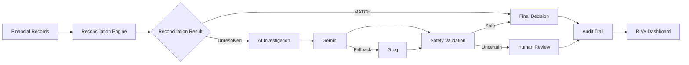

# RIVA — AI Finance Controller

### Reconciliation & Investigation Virtual Agent

**An AI-powered financial reconciliation and investigation system combining deterministic controls, evidence-grounded AI reasoning, provider fallback, safety validation, and human review.**

RIVA reconciles financial transactions across **company ledger, settlements, bank statements, and invoices**. Deterministic rules handle financial calculations first; AI investigates unresolved cases and uncertain cases can be escalated instead of guessed.

- **Reconcile financial evidence** — compare ledger, settlement, bank, and invoice records.
- **Investigate unresolved cases** — Gemini primary with Groq fallback.
- **Stay evidence-grounded** — expose the evidence and prompt used for investigations.
- **Review every decision** — track provider, confidence, safety override, reason, and final decision.
- **Operate from one dashboard** — Overview, Transaction Inspector, Settlement Q&A, Audit Trail, and Human Review.


---

## ✦ Contents

- [Overview](#-overview)
- [Architecture](#-architecture)
- [Dashboard](#-dashboard)
- [AI Investigation](#-ai-investigation)
- [Explainability & Auditability](#-explainability--auditability)
- [Evaluation](#-evaluation)
- [Project Structure](#-project-structure)
- [Setup](#-setup)
- [Safety & Reliability](#-safety--reliability)
- [Security](#-security)
- [Current Status](#-current-status)
- [Future Improvements](#-future-improvements)

---

## ✦ Overview

RIVA is built around a simple principle:

> **Use deterministic code where financial certainty matters, and AI where investigation and reasoning help.**

The system processes a synthetic dataset of **500 financial transactions** and combines:

| Layer | Responsibility |
| --- | --- |
| **Financial records** | Ledger, settlements, bank statement, and invoices |
| **Reconciliation** | Deterministic transaction and amount checks |
| **AI investigation** | Investigation of unresolved cases |
| **Safety validation** | Confidence and escalation controls |
| **Decision & audit** | Final decision plus traceable investigation data |
| **RIVA dashboard** | Interactive inspection and review |

---

## ✦ Architecture



<details>
<summary><strong>How the architecture works</strong></summary>

1. **Financial records** provide the evidence used for reconciliation.
2. **Reconciliation Engine** performs deterministic checks across the available records.
3. **Matched cases** can be resolved directly without an LLM.
4. **Unresolved cases** move to the AI investigation stage.
5. **Gemini** is used as the primary AI provider.
6. **Groq** provides the fallback path when Gemini cannot complete the investigation.
7. **Safety validation** checks the AI result before the final outcome.
8. **Human Review** is available for cases that should not be resolved automatically.
9. **Audit Trail** retains the investigation metadata.
10. **RIVA Dashboard** exposes the resulting evidence and decisions.

</details>

### Decision flow

**Financial records → Reconciliation → AI investigation when needed → Safety validation → Final decision → Audit trail**

---

## ✦ Dashboard

RIVA provides five focused views:

| View | Purpose |
| --- | --- |
| **Overview** | Dataset metrics, reconciliation health, benchmark verification, scenario breakdown, and recent exceptions |
| **Transaction Inspector** | Inspect ledger, settlement, bank, invoice, reconciliation, and AI evidence for one transaction |
| **Settlement Q&A** | Ask transaction-specific questions using recorded evidence |
| **Audit Trail** | Review AI provider, decision, confidence, safety status, and reason |
| **Human Review** | Read-only queue for transactions requiring manual review |

### Overview metrics

The current synthetic evaluation contains **500 transactions**.

| Decision | Count | Share |
| --- | ---: | ---: |
| MATCH | **373** | 74.6% |
| HUMAN_REVIEW | **69** | 13.8% |
| EXCEPTION | **58** | 11.6% |
| **Total** | **500** | **100%** |

---

## ✦ AI Investigation

RIVA uses **Gemini as the primary provider** and **Groq as the fallback** when the primary investigation cannot complete.

| AI metric | Result |
| --- | ---: |
| AI cases | **58** |
| Gemini investigations | **52** |
| Groq fallback | **6** |
| API errors | **0** |
| Safety overrides | **0** |

<details>
<summary><strong>AI decision path</strong></summary>

```text
Unresolved transaction
        │
        ▼
     Gemini
        │
   ┌────┴────┐
 success   failure
   │          │
   │          ▼
   │        Groq
   │          │
   └────┬─────┘
        ▼
 Safety validation
        │
   ┌────┴──────────┐
   ▼               ▼
Decision       HUMAN_REVIEW
```

AI output is not treated as financial truth by itself. Investigations remain grounded in the recorded transaction evidence.

</details>

---

## ✦ Explainability & Auditability

RIVA exposes the evidence behind AI-assisted investigations instead of presenting an unexplained model output.

<details>
<summary><strong>What can be inspected</strong></summary>

- **Evidence Used** — financial records supplied to the investigation.
- **Prompt Sent to the Model** — the constructed investigation prompt.
- **AI Response** — provider response and resulting decision.
- **Provider** — Gemini or Groq.
- **Confidence** — recorded confidence score.
- **Safety Override** — recorded safety status.
- **Reason** — explanation associated with the decision.
- **Final Decision** — final system outcome.

</details>

### Example: TXN0013

**TXN0013** demonstrates how RIVA handles missing bank evidence.

| Evidence | Result |
| --- | --- |
| Ledger | ₹7,500 |
| Settlement | ₹7,500 |
| Invoice | ₹7,500 |
| Bank record | **Missing** |
| Final decision | **EXCEPTION** |

A missing bank record is **not treated as a zero-value credit**. The transaction therefore cannot be fully reconciled and is flagged as an exception.

---

## ✦ Evaluation

The current benchmark is based on the project's **synthetic dataset and ground-truth labels**.

| Metric | Result |
| --- | ---: |
| Correct decisions | **500** |
| Total decisions | **500** |
| Accuracy | **100.00%** |
| Incorrect | **0** |
| Unresolved | **0** |

> **Note:** 100.00% is the result on the current synthetic evaluation dataset. It should not be interpreted as real-world production accuracy.

<details>
<summary><strong>Evaluation pipeline</strong></summary>

```text
Ground-truth labels
        +
Rule decisions
        +
AI decisions
        ↓
evaluation_results.csv
        ↓
Benchmark metrics
```

</details>

---

## ✦ Project Structure

```text
ai-finance-controller/
├── data/
│   ├── ai_cases.csv
│   ├── audit_log.csv
│   ├── bank_statement.csv
│   ├── company_ledger.csv
│   ├── evaluation_results.csv
│   ├── ground_truth.csv
│   ├── invoices.csv
│   ├── reconciliation_results.csv
│   ├── settlements.csv
│   └── unmatched_cases.csv
│
├── src/
│   ├── app.py
│   ├── reconciler.py
│   ├── ai_investigator.py
│   ├── settlement_qna.py
│   ├── inspector.py
│   ├── evaluator.py
│   ├── dashboard.py
│   └── data_generator.py
│
├── .env
├── .gitignore
├── README.md
└── requirements.txt
```

<details>
<summary><strong>Module responsibilities</strong></summary>

| Module | Responsibility |
| --- | --- |
| `app.py` | Main Streamlit application and interactive dashboard |
| `reconciler.py` | Deterministic reconciliation |
| `ai_investigator.py` | AI investigation and Gemini → Groq fallback |
| `settlement_qna.py` | Evidence-grounded transaction Q&A |
| `inspector.py` | Transaction-level inspection |
| `evaluator.py` | Ground-truth benchmark evaluation |
| `dashboard.py` | Terminal dashboard |
| `data_generator.py` | Synthetic financial data generation |

</details>

---

## ✦ Setup

### 1. Install dependencies

```bash
pip install -r requirements.txt
```

### 2. Configure API keys

Create a `.env` file in the project root:

```env
GEMINI_API_KEY=your_gemini_api_key
GROQ_API_KEY=your_groq_api_key
```

> Never commit `.env` or real API keys to GitHub.

### 3. Run the RIVA dashboard

```bash
streamlit run src/app.py
```

Then open:

```text
http://localhost:8501
```

### Optional: regenerate and evaluate the dataset

Run the pipeline in order:

```bash
python src/data_generator.py
python src/reconciler.py
python src/ai_investigator.py
python src/evaluator.py
```

### Inspect a transaction

```bash
python src/inspector.py TXN0013
```

### Run Settlement Q&A

```bash
python src/settlement_qna.py
```

---

## ✦ Safety & Reliability

RIVA is designed so that AI is not the only source of truth.

- **Deterministic calculations** — financial arithmetic and reconciliation checks are handled programmatically.
- **No fabricated evidence** — missing records remain missing.
- **Evidence-grounded AI** — investigations use recorded transaction evidence.
- **Provider fallback** — Groq provides a fallback path when Gemini cannot complete an investigation.
- **Human escalation** — uncertain cases can remain `HUMAN_REVIEW`.
- **Auditability** — AI-assisted decisions retain investigation metadata.
- **Missing-record protection** — an absent bank record is not interpreted as a zero-value credit.

---

## ✦ Security

API credentials are kept in `.env` and excluded from Git tracking.

The repository's ignore rules include:

```text
.env
__pycache__/
*.pyc
.vscode/
```

Never publish real API keys, credentials, or other secrets in source files or documentation.

---

## ✦ Current Status

| Capability | Status |
| --- | :---: |
| Deterministic reconciliation | ✅ |
| Multi-source evidence matching | ✅ |
| Gemini investigation | ✅ |
| Groq fallback | ✅ |
| Safety validation | ✅ |
| Streamlit dashboard | ✅ |
| Transaction Inspector | ✅ |
| Settlement Q&A | ✅ |
| Audit Trail | ✅ |
| Human Review queue | ✅ |
| Ground-truth evaluation | ✅ |
| Evidence and prompt inspection | ✅ |

---

## ✦ Future Improvements

- Persistent database storage
- Authentication and role-based access
- Exportable investigation reports
- Additional anomaly scenarios
- More AI provider integrations
- Production monitoring and deployment

---

## ✦ License

Educational project.
